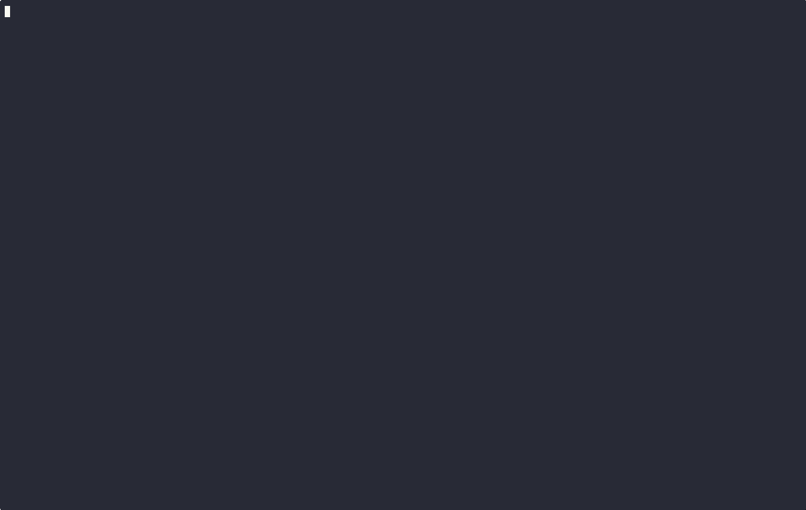

# Pull Requests

[](https://www.npmjs.com/package/@adalbertosteixeira/pull-requests-cli)

Tool to automate the creation of PRs for JavaScript repositories, using Clickup as the issue manager
and Claude as the AI assistant.

The end goal is to get as close as possible to getting a PR deployed using only AI and automations
looking at Clickup issues.

Currently implemented:

- Get description from a Clickup ticket and pipe it into Claude code locally;
- Build the ticket description, test steps, etc suing Calude code.

This tool is currently tied heavily to my specific use case. Improvements to accommodate other use
cases aren't currently in the Roadmap, but might be considered if tests start being added.

## Highlights
- Loads Clickup issues as the basis for the prompt piped into Claude.
- When a pre-commit hook fails, the next run automatically suggests the previously entered commit
message;
- Helps build a Github PR template and automatically check tasks.
- Extracts id and name from the branch name;
- Extracts type (and, in the future, scope) from the changed files;
- Output the pre-build pr template by passing `-r`.

<details>
<summary>

## Install

</summary>

### Install from npm (Recommended)

Install globally:
```bash
npm install -g @adalbertosteixeira/pull-requests-cli@latest
```

Or install as a dev dependency in your project:
```bash
npm install --save-dev  @adalbertosteixeira/pull-requests-cli@latest
```

Then add a script to your `package.json`:
```json
{
  "scripts": {
    "commit": "npx @adalbertosteixeira/pull-requests-cli commit",
    "issue": "npx @adalbertosteixeira/pull-requests-cli ticket issue ******",
  }
}
```

The package includes pre-built binaries for:
- macOS (x64, arm64)
- Linux (x64)
- Windows (x64)

### Download binary
Navigate to the releases tab and download the latest `pull_requests` file for your platform.

### Build from source
Clone the repository and run

```bash
cargo build --release
```

For npm package maintainers, build all platforms:
```bash
npm run build
```

Add `.pull_requests` to your `.gitignore`.

> [!TIP]
> If installing through download or local build, add the resulting binary to the path: `export PATH="$PATH:/User/folder/"`.
</details>

<details>
<summary>

## Setup

</summary>

### Add Clickup keys
```
export CLICKUP_API_KEY= ********************************************
export CLICKUP_WORKSPACE_ID=**********
```


### Install Claude Code
See documentation at [anthropic](https://www.anthropic.com/claude-code).

</details>


## Usage

> [!TIP]
> The first time the tool is run an editor setup prompt will appear. For now only terminal based
`$EDITOR`s are mentioned, plus how to install VSCode usage.

> [!NOTE]
> For clarity and ease of use we're using the npm command, but running the binary directly will be faster.

### Getting issue from Clickup  or Github
```
npx @adalbertosteixeira/pull-requests-cli ticket issues
```

This command will allow you to get the description for issues in either Github or Clickup. It will
then pipe the issue description to Claude using the following prompt:


> Given the following issue description, implement all the changes required to the codebase.


### Commit helper



The commit helper always the user to automate tasks to get the code into the repository:
- create a commit message;
- create a description based of a template;
- push the branch to the repository.

#### Commit message

The commit message will follow the pattern:

`TYPE: MESSAGE [TEAM] #ID`

**Base usage**
This option will try to take the values from the branch name and the code changed and prompt the
user for the template creation.

```{sh}
npx @adalbertosteixeira/pull-requests-cli commit
```


**With Claude**
This option will try to take the values from the branch name and the code changed and use Claude to
build the PR template.
```{sh}
npx @adalbertosteixeira/pull-requests-cli commit --claude
```

**Flags and options**
```{sh}
npx @adalbertosteixeira/pull-requests-cli commit --help
```

#### Pushing to origin

The tool will prompt you to push the branch to the origin.

If no origin is set, it will propose a new origin and set the upstream.

It's possible to only push to origin using the `push` command:

```{sh}
npx @adalbertosteixeira/pull-requests-cli push
```


### Get help

Help is available at any time by running
```{sh}
yarn commit -h
```


## @TODO
- [ ] add tests;
- [ ] add support for scopes;
- [ ] cleanup old commit message files;
- [ ] add support for other languages;
- [x] install the library using yarn/npm;
- [ ] support for different systems (currently only macOS is tested);
- [ ] allow usage in Github Actions to automatically update the fields like labels based on scopes,
etc).
- [ ] allow using a config file at the repository level;
- [ ] automate adding`.pull_requests` to the `.gitignore` file;
- [ ] allow reuse of existing PR template (changing fields if necessary);
- [ ] create pull request from the branch if it doesn't exist yet;
- [ ] automate version bumping and tagging.
- [ ] allow customizing the commit message 
- [ ] When running pre-commits and pre-pushes, if there are errors, prompt the user to pipe the
result to Claude
- [ ] allow customizing the PR template 
- [ ] implement Github and Clickup issues temporary caching
